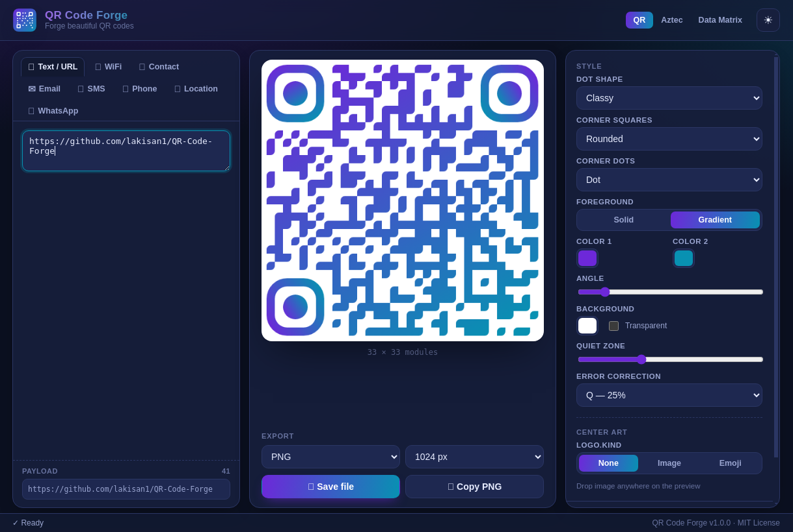

# QR Code Forge

Forge beautiful QR codes — offline, no telemetry, MIT licensed.



Modern desktop QR code / 2D-barcode generator built with **Electron + Vite + TypeScript**.

## Features

- **Styled dots** — square, rounded, dots, classy; styled corner squares and corner dots
- **Solid or gradient colors** — linear/radial gradient with angle control, transparent background
- **Center art** — upload a logo or photo (file picker or drag & drop), or pick an emoji;
  error correction is auto-raised to **H** so the code stays scannable
- **Structured payloads** — WiFi join, vCard contact, Email, SMS, phone number,
  geo location, WhatsApp
- **Extra 2D barcodes** — Aztec and Data Matrix
- **Export** — PNG / JPG / SVG at 256–4096 px, or copy the PNG straight to the clipboard
- **Batch mode** — paste or import a list (one code per line, or a `name,content` CSV)
  and export every code at once as a ZIP archive, each rendered with the current style
- **History** — recent codes are remembered and one click away
- **Themes** — modern dark and light UI, fully i18n-ready string table (`src/i18n/en.json`)

## Download

Grab the latest build from
[**Releases**](https://github.com/lakisan1/QR-Code-Forge/releases):

| Platform | Artifact |
| --- | --- |
| Windows (installer) | `QR-Code-Forge-Setup-1.0.0.exe` |
| Windows (portable) | `QR-Code-Forge-Portable-1.0.0.exe` |
| Linux (AppImage) | `QR-Code-Forge-1.0.0-x86_64.AppImage` |
| Linux (Flatpak) | `QR-Code-Forge-1.0.0.flatpak` — install with `flatpak install ./QR-Code-Forge-1.0.0.flatpak` |

## Build from source

```bash
npm install
npm run build        # renderer (vite) + main process (tsc)
npm start            # build + launch the app
npm test             # unit tests (payload builders, SVG serializer)
npm run typecheck
```

### Packaging

```bash
npm run dist:win     # Windows NSIS installer + portable exe
npm run dist:linux   # Linux AppImage
npm run flatpak      # Flatpak: build + install locally
npm run flatpak -- --bundle    # also emit a single-file .flatpak bundle
npm run icons        # regenerate app icons (tools/gen-icons.mjs)
```

The Flatpak manifest (`flatpak/io.github.lakisan1.qrcodeforge.yml`) targets the
Freedesktop 24.08 runtime with the Electron BaseApp and builds the renderer from
source inside the sandbox; Chromium sandboxing is provided by zypak.

## Security model

The renderer runs with `contextIsolation: true`, `sandbox: true` and no node
integration. Everything privileged (save dialogs, clipboard writes) goes
through a minimal IPC bridge (`electron/preload.ts` → `electron/main.ts`).
External links always open in the system browser.

## License

[MIT](LICENSE)
